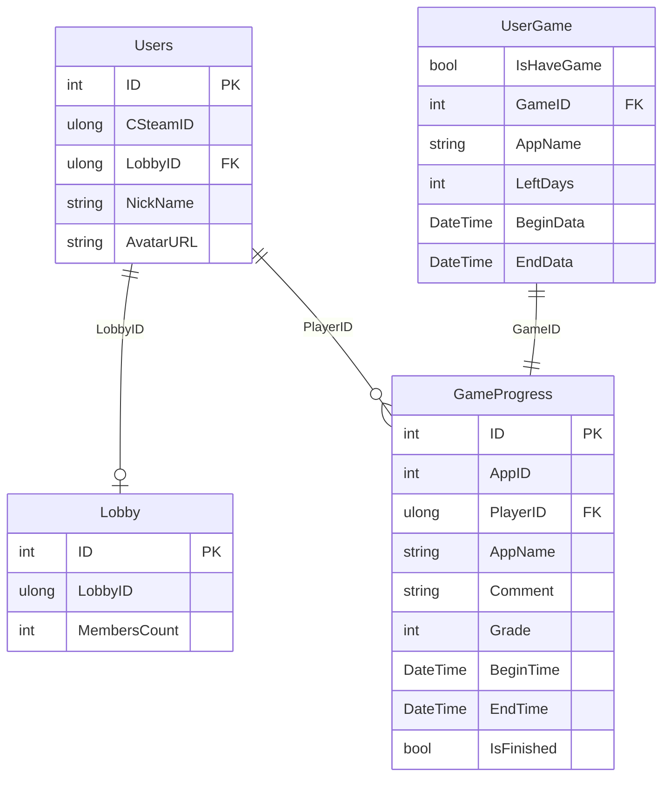

# Database Schema

## Users

|Type|Name|
|---|---|
|int|ID|
|ulong|CSteamID|
|ulong|LobbyID|
|string|NickName|
|string|AvatarURL|

---

## Lobby

|Type|Name|
|---|---|
|int|ID|
|ulong|LobbyID|
|int|MembersCount|

---

## GameProgress

|Type|Name|
|---|---|
|int|ID|
|int|AppID|
|ulong|PlayerID|
|string|AppName|
|string?|Comment|
|int|Grade|
|DateTime|BeginTime|
|DateTime|EndTime|
|bool|IsFinished|

---

## UserGame

| Type     | Name       | Reference                |
| -------- | ---------- | ------------------------ |
| bool     | IsHaveGame |                          |
| int      | GameID     | FK → GameProgress.ID     |
| string   | AppName    | ← GameProgress.AppName   |
| int      | LeftDays   |                          |
| DateTime | BeginData  | ← GameProgress.BeginTime |
| DateTime | EndData    | ← GameProgress.EndTime   |

---

## ER Диаграмма

---